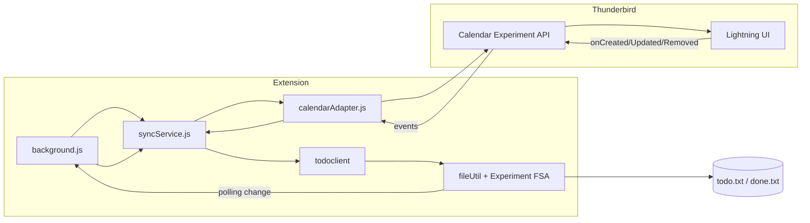

# Integración con el calendario (Lightning)

Esta extensión puede sincronizar tareas de todo.txt con un calendario local en Thunderbird (Lightning), de forma bidireccional. Solo las tareas que tengan **fecha de vencimiento** (`due:YYYY-MM-DD`) aparecen en el calendario.

## Requisitos

- **Thunderbird 140.7 ESR** (o superior).
- La integración usa la **Experiment API** de calendario del proyecto [webext-experiments](https://github.com/thunderbird/webext-experiments) (carpeta `calendar`). Si tu instalación de Thunderbird no incluye o no carga correctamente estos experimentos, la API no estará disponible y solo podrás usar el **fallback**: exportar tareas con fecha a un archivo ICS e importarlas manualmente.

## Cómo activar

1. Abre **Opciones** de la extensión (clic derecho en el icono → Opciones, o desde el popup).
2. En la sección **Calendario (Lightning)**:
   - Activa **"Habilitar integración con Calendar"**.
   - Elige el calendario con el que sincronizar (por defecto se crea o selecciona el calendario **"Todo.txt"**).
   - Opcional: desactiva **"Sincronización automática"** si prefieres sincronizar solo manualmente (por ejemplo desde un botón futuro o al abrir la extensión).
3. Guarda. La extensión creará el calendario "Todo.txt" si no existe y empezará a rellenarlo con las tareas que tengan `due:`.

## Mapeo de datos (todo.txt ↔ VTODO)

| todo.txt | Calendario (VTODO) |
|----------|--------------------|
| Línea con `due:YYYY-MM-DD` | Tarea en el calendario con DUE en esa fecha |
| `x` + fecha de completado | STATUS:COMPLETED y COMPLETED |
| `+proyecto` | CATEGORIES (categoría del VTODO) |
| Título (texto principal) | SUMMARY |
| **No se mapea** `@context` | — |

- Las tareas **sin** `due:` no se crean en el calendario; siguen visibles solo en la interfaz de la extensión.
- Si editas una tarea en el calendario (título, fecha, completado, categoría), los cambios se escriben en todo.txt.

## Arquitectura

- **calendarAdapter.js**: habla con `messenger.calendar` (calendars + items). Crea el calendario "Todo.txt", convierte ítems plain ↔ ICAL VTODO, y registra listeners de cambios.
- **syncService.js**: decide si la sincronización está activa (preferencias), evita bucles (marcando origen del cambio) y llama a todoclient o al adapter según el origen.
- **background.js**: arranca el polling, detecta cambios en todo.txt y llama a `syncService.onTodoTxtFileChanged()`; arranca `syncService.start()` cuando la integración está activada.

## Limitaciones conocidas

- **Dependencia de la Experiment API**: Si Thunderbird no carga los experimentos de calendario (p. ej. en algunas builds o distribuciones), la integración no funcionará. En ese caso se muestra un aviso en Opciones y se ofrece **Exportar a ICS** para importación manual.
- **Resolución de conflictos**: por ahora se aplica "último cambio gana"; no hay fusión por timestamps ni preferencia de usuario.
- **Sin mapeo de @context**: los contextos de todo.txt no se sincronizan al calendario.
- **Sincronización automática**: depende del polling de todo.txt (intervalo configurado en la extensión); no hay file watcher en tiempo real.

## Fallback: exportar a ICS

Cuando la API de calendario **no** está disponible:

1. En Opciones, en la sección Calendario verás el mensaje de que la API no está disponible.
2. Usa el botón **"Exportar a ICS"** para generar un archivo con todas las tareas que tengan `due:`.
3. En Thunderbird: **Calendario → Importar** y selecciona el archivo ICS descargado.

## Cómo validar manualmente (Thunderbird 140.7 ESR)

1. Instala la extensión en un perfil de prueba (o carga temporal).
2. Configura las rutas de todo.txt y done.txt en Opciones.
3. Activa **"Habilitar integración con Calendar"** y guarda.
4. Crea en todo.txt al menos 3 líneas:
   - Una **sin** `due:` (ej. `Tarea sin fecha`).
   - Dos **con** `due:2025-12-01` y `due:2025-12-02` (y opcionalmente `+proyecto`).
5. Abre la vista de **Calendario** en Thunderbird y comprueba que el calendario "Todo.txt" existe y muestra solo las dos tareas con fecha.
6. Edita una tarea en el calendario (por ejemplo márcala como completada o cambia la fecha) y comprueba que el cambio se refleja en todo.txt (tras el siguiente polling o al recargar).
7. Edita todo.txt (añade `due:2025-12-03` a una tarea o crea una nueva con due) y comprueba que en un lapso razonable aparece en el calendario.

## Permisos y revisión en addons.thunderbird.net

La extensión declara **experiment_apis** para `calendar_calendars` y `calendar_items`. Estos experimentos se incluyen en el paquete de la extensión (carpeta `experiments/calendar/`) y requieren que Thunderbird cargue scripts en el ámbito `addon_parent`. En la ficha del complemento en ATN conviene explicar que la integración con el calendario usa APIs experimentales de calendario y que, si no están disponibles, la extensión sigue funcionando con exportación a ICS.

## Referencias

- [Análisis de la Experiment API de calendario](experiments-calendar-analysis.md)
- [webext-experiments/calendar](https://github.com/thunderbird/webext-experiments/tree/main/calendar)
